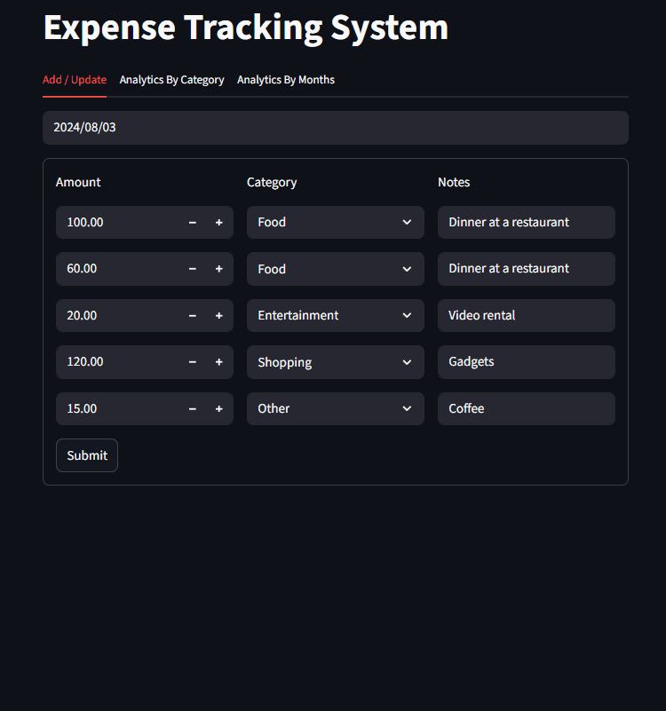
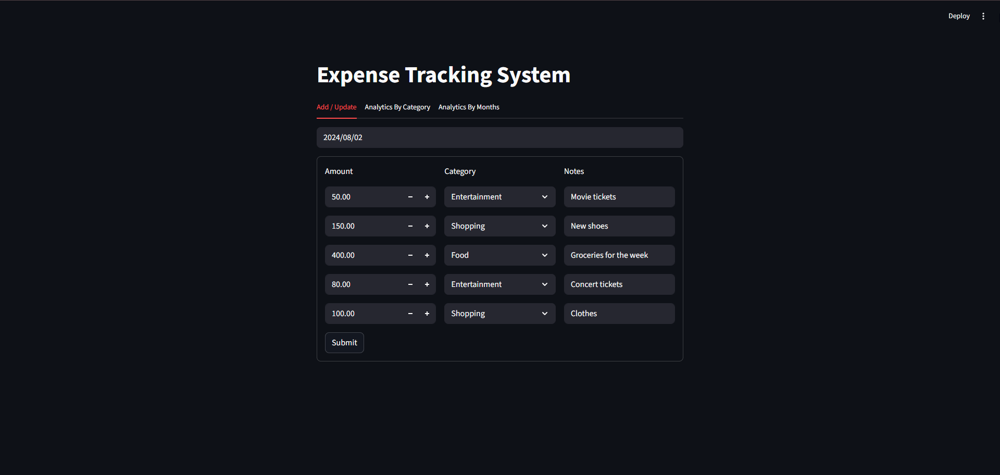
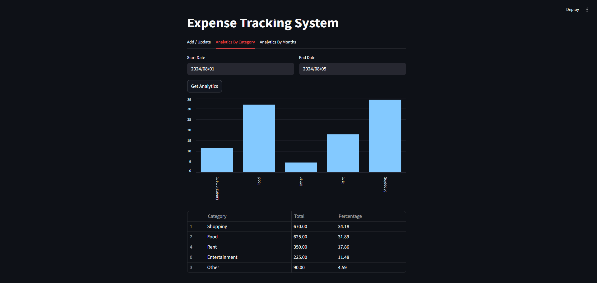
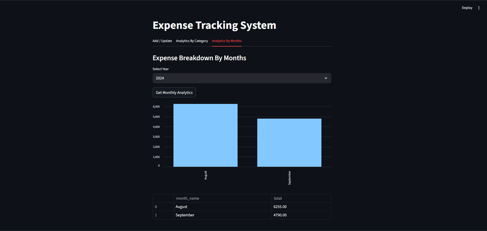

# Expense Tracking System

A Python-based Expense Tracking System to manage daily expenses, categorize transactions, and analyze spending patterns. Built using **FastAPI**, **Streamlit**, and **MySQL** with full CRUD functionality and a monthly analytics dashboard.

---

## 🎥 Application Demo

---

## 📸 Screenshots

### ➤ Add / Update Expenses

### ➤ Analytics By Category

### ➤ Analytics By Months

---

## 🚀 Features

- Add, update, and delete daily expenses
- Categorize transactions (Food, Shopping, Entertainment, Rent, etc.)
- Date-based expense tracking
- Category-wise analytics with percentage breakdown
- Monthly expense summary by year
- Interactive dashboard using Streamlit
- RESTful APIs built with FastAPI
- MySQL database integration
- Structured logging
- Backend and frontend test cases

---

## 🏗️ P
